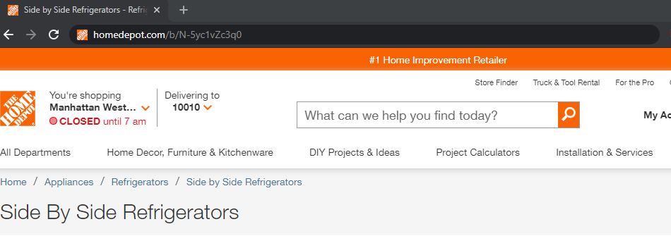
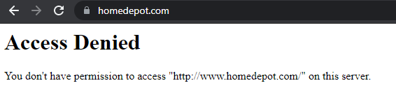

# HD Appliance Finder


<!-- PROJECT LOGO -->
<p align="center">
    
  </a>

  <h3 align="center">Appliance Finder</h3>

  <p align="center">
        Appliance Finder, helps you save precious time checking availability for appliances delivery.
        You only need to select the appliance that you are interested and zip code and we compile a list of available appliances.
	
	
	
    <br>
    <a href="https://github.com/RicardoSu/HD-Appliance-Finderstatic/images/demo.gif">View Demo</a>
    ·
    <a href="https://github.com/RicardoSu/HD-Appliance-Finder/issues">Report Bug</a>
    ·
    <a href="https://github.com/RicardoSu/HD-Appliance-Finder/issues">Request Feature</a>
  </p>
</p>


<!-- TABLE OF CONTENTS -->
<details open="open">
  <summary>Table of Contents</summary>
  <ol>
    <li>
      <a href="#about-the-project">About The Project</a>
      <ul>
        <li><a href="#built-with">Built With</a></li>
      </ul>
    </li>
    <li>
      <a href="#getting-started">Getting Started</a>
      <ul>
        <li><a href="#prerequisites">Prerequisites</a></li>
        <li><a href="#installation">Installation</a></li>
      </ul>
    </li>
    <li><a href="#usage">Usage</a></li>
    <li><a href="#roadmap">Roadmap</a></li>
    <li><a href="#contributing">Contributing</a></li>
    <li><a href="#contact">Contact</a></li>
  </ol>
</details>


<!-- ABOUT THE PROJECT -->
## About The Project


There are many different ways to find and organize data online; however, I didn't find one that suits my needs, so I decided to create this project; it was inspired by one of the significant issues that I was facing finding available products and saving time for myself and my customers.

* HD-Appliance-Finder reduces drastically the search time for an product
* The creation of appliances packages and bundles that have an average of and hour can be cut in less than half

### Built With

* [Python 3.9](https://www.python.org/downloads/release/python-390/)
* [Flask](https://flask.palletsprojects.com/en/2.0.x/)
* [Python Libraries (beautifulsoup4,async,Jinja2)](https://github.com/RicardoSu/HD-Appliance-Finder/blob/main/requirements.txt)


<!-- GETTING STARTED -->
## Getting Started

Windows Instructions:

### Prerequisites

* Python 3.9
* PIP

### Installation

Please make sure on windows run a cmd as administrator

1. Clone the repo
   ```sh
   git clone https://github.com/RicardoSu/HD-Appliance-Finder.git
   cd HD-Appliance-Finder
   ```
3. Install virtualenv and create a env
   ```sh
   pip install virtualenv
   virtualenv env
   .\env\Scripts\activate
   ```
4. Pip install requirements.txt in the env
   ```sh
   pip install -r requirements.txt
   ```
5. Run the webserver
   ```sh
   .\env\Scripts\activate
   python app.py
   ```
6. To run in debug mode change file app.py
```python
if __name__ == '__main__':
    app.run(debug=True)
```

<!-- USAGE EXAMPLES -->
## Usage

The base of this project is the usage of the python code to scrape the home depot website to
store tha data and diplay an organized list with only available items. First we need to understand how
the home depot website is organized.

The home depot website categorize items with a N-code this means that each category have an specific N-code for example:

https://www.homedepot.com/b/N-5yc1vZc3q0



"5yc1vZc3q0" will display an array of Side By Side Refrigerators
With this information in mind the file /pyton_code/appliances.json can be changed to gather specified items

```json
"washing_machine": {
		"front_load_washers": "5yc1vZc3pj",
		"top_load_washers_agitator": "5yc1vZc3ocZ1z17rwr",
		"top_load_washers_impeller": "5yc1vZc3ocZ1z17ryq"
        }

```

1. The first code Home depot SKU Parser or hd_sku_parser_1.py:


This code uses the selenium web driver to scrape home depot SKUS
SKUS or Stock keeping unit are numbers given to merchandise to
easily track and categorize products, this code reads a JSON file
and scrapes the home depot website with the provided N-value that Home
Depot uses to order similar products, and return organized JSON files
 with the new data.
 
 
 2. Home depot DATA Parser OR hd_data_parser_2.py:
This code uses the data stored data from Home depot SKU Parser
and creates JSON files with the products specifications gathered from a 
hidden home depot API used for custumer reviews, and
stores in organized json files.

https://api.bazaarvoice.com/data/reviews.json?apiversion=5.4&Filter=ProductId:{#ITEM-NUMBER}&Include=Products&Limit=1&Passkey=u2tvlik5g1afeh78i745g4s1d

This usually bans you from home depot



3. Home depot AVAILABILITY Parser OR hd_availability_parser_3_async.py:
This code uses the data stored data from Home depot DATA Parser
to ckeck if the products are available on given zip code, using an Synchronous request it
returns a dictionary with earliestAvailabilityDate and if products
are availabe or backordered, out of stock products are not diplayed

Code is run during flask application


<!-- ROADMAP -->


## Roadmap

See the [open issues](https://github.com/RicardoSu/HD-Appliance-Finder/issues) for a list of proposed features (and known issues).


<!-- CONTRIBUTING -->
## Contributing

Contributions are what make the open source community such an amazing place to be learn, inspire, and create. Any contributions you make are **greatly appreciated**.

1. Fork the Project
2. Create your Feature Branch (`git checkout -b feature/AmazingFeature`)
3. Commit your Changes (`git commit -m 'Add some AmazingFeature'`)
4. Push to the Branch (`git push origin feature/AmazingFeature`)
5. Open a Pull Request


<!-- CONTACT -->
## Contact

Ricardo Suarez - ricardolimasuarez@gmail.com

Project Link: [HD-Appliance-Finder](https://github.com/RicardoSu/HD-Appliance-Finder/)
				    
